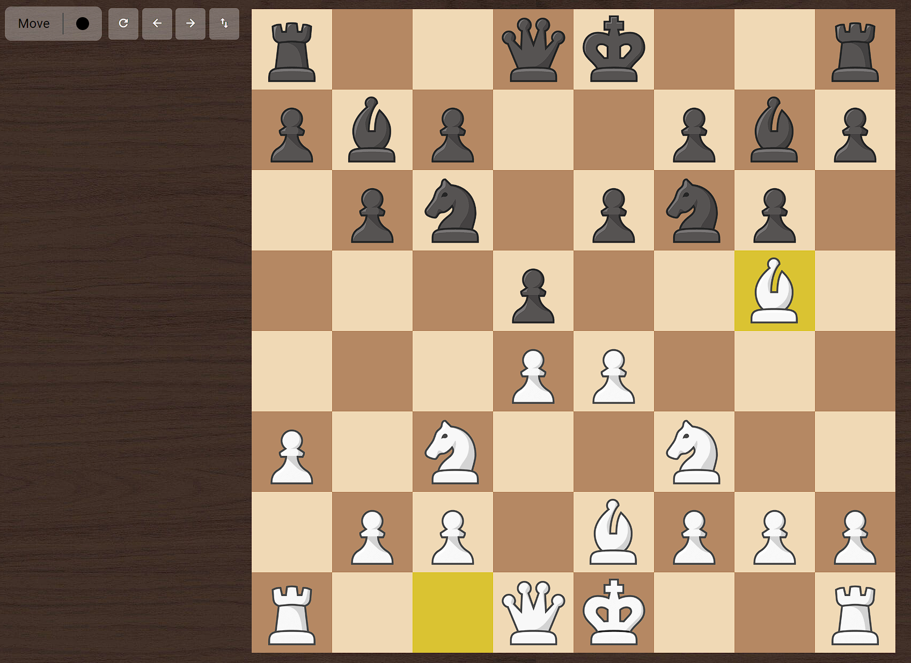

# Chess

This project is a single player version of the classic game of chess built in Angular, Typescript, HTML and CSS.


## Screenshots


<!--  -->
    
## Run Locally

Clone the project

```bash
  git clone https://github.com/piotrv1001/Chess_Angular.git
```

Go to the project directory

```bash
  cd Chess_Angular
```


Install dependencies

```bash
  npm install
```


Start the server

```bash
  ng serve --open
```


## Features

- All chess rules implemented
- Resetting the board
- Restoring previous moves
- Move highlighting
- Checkmate detection
- Pawn promotion


